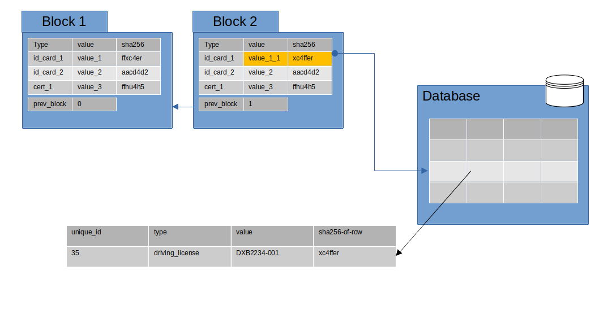

# HuCaBLOCK
Repository to work on the Blockchain implementation for Human Capital Resources

# Main Idea
The idea here is to create and implement a Human Capital Blockchain Ledger. This ledger can work/implement at a Global or Country level.

There would be a blockchain created for every Human Being, which would have the following items/properties/attributes.

1. All the records from Birth to Schooling to Higher Education to Job/Business to Retirement to Death will be recorded into the block
2. Each block can have multiple transactions
3. Each block will have attributes that can have actual value or could point to some other entity. Would prefer a key-value mechanism
4. Each transaction could be the change of an actual value or could be a change to the pointer value to some system/recordset. The pointer could be some storage location or DB record id, etc.
5. The sole owner a HuCa Blockchain would be the Owner or the Human Being itself. However, it can have a co-owner (the concept of Nominee) in case of Death
6. Each transaction will have an approval process. The approvers should be Self, a Local authority Officer from the Local Government, a Doctor chosen by the Owner and a Lawyer chosen by the Owner
7. Once all the approval process are done, then only the block would be added to the blockchain

Following is a pictorial represenation on how a block is represented, what are its transaction values and how each transaction value is linked to a external record/database (Here database can be of any type RDBMS/NoSQL)

In the above diagram we represent on how a value to the record would impact the blockchain.

The main idea here is, the DB/record system should have a SHA256 calculated for each of it's record or document, and stored as an attribute or column inside the table/collection. This should be automatically calculated and can be queried but cannot be modified.

As soon as the document/record gets updated, the SHA256 is re-calculated. However, while doing so, the action should invoke a Smart Contract code which would create a transaction in the block or blockchain, and thus create a new block into the blockchain.

If by any chance, some DB admin updated the record and the Smart contract was not called to create a new block, a periodic check script should continuosly check if the SHA256 value inside the last Block is available in the database, and if not, then it invalidates the block, thereby invalidating the blockchain as such.

To introduce more controls into the system, sha256 calculation can be added at Database partition and shard level.

# Next steps
These are just my initial thoughts, more items are to be added

# Technology
1. We can use Hyperledger Blockchain for the same
2. We can use Smart Contracts

# Question
There could be a question here, as the same could be implemented in a Government Owned/Controlled Database where some records, ownership and approval process needs to be created. Yes, however, it will have the traditional problems of Who control's what, it would be centrally managed, risks of hack, and no control of auditing.